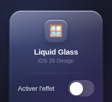
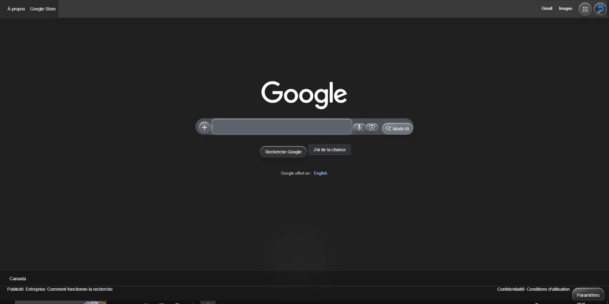
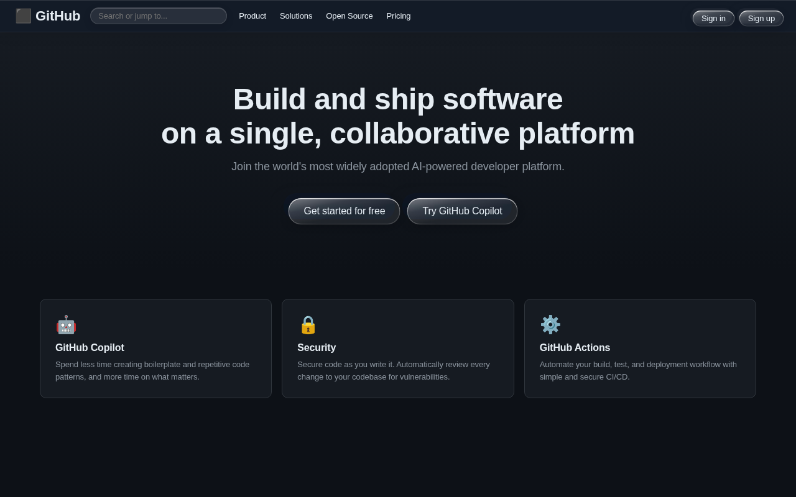
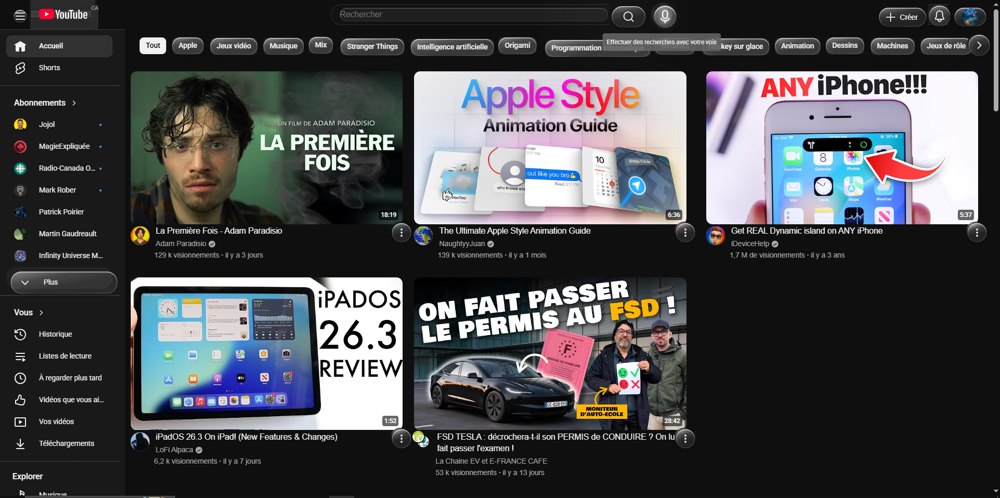
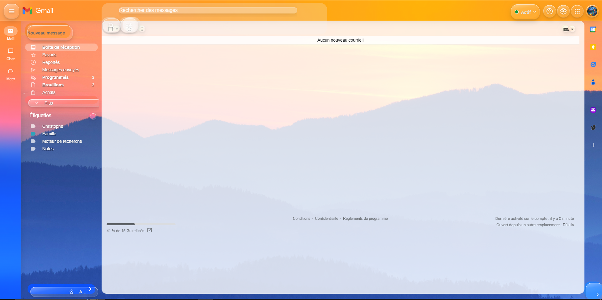
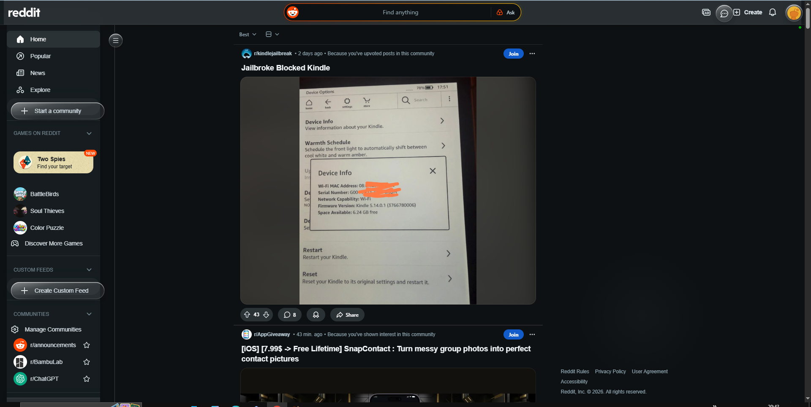

# 🪟 iOS 26 Liquid Glass — Chrome Extension

Une extension Google Chrome qui applique l'effet **Liquid Glass** d'Apple (iOS 26) sur n'importe quel site web.  
Boutons translucides, reflets spéculaires, flou givré, animations fluides — directement dans votre navigateur.

---

## ✨ Qu'est-ce que c'est ?

**Liquid Glass** est le nouveau langage de design introduit par Apple avec iOS 26. Il repose sur :

- 🔲 **Backdrop blur** — les éléments laissent transparaître le contenu derrière eux, comme du verre dépoli
- ✨ **Reflets spéculaires** — un dégradé lumineux simulant la réfraction de la lumière sur le verre
- 🌈 **Saturation amplifiée** — les couleurs derrière les éléments ressortent, plus vives
- 🔵 **Bordures dégradées** — un fin liseré lumineux autour de chaque bouton
- 💫 **Animations élastiques** — les boutons répondent avec un rebond iOS authentique

Cette extension injecte automatiquement ces effets sur **tous les sites** : boutons, champs de texte, barres de navigation, liens…

---

## 📸 Screenshots

### Popup de l'extension
<p align="center">
  
</p>

### Sur Google
<p align="center">
  
</p>

### Sur GitHub
<p align="center">
  
</p>

### Sur YouTube
<p align="center">
  
</p>

### Sur Gmail
<p align="center">
  
</p>

### Sur Reddit
<p align="center">
  
</p>

---

## 🚀 Installation dans Google Chrome

L'extension n'est pas encore disponible sur le Chrome Web Store. Suivez ces étapes pour l'installer manuellement en **mode développeur** :

### Étape 1 — Télécharger l'extension

Clonez le dépôt ou téléchargez-le en ZIP :

```bash
git clone https://github.com/Gnof-the-shark/LiquidGlass-for-Google-Chrome.git
```

Ou cliquez sur **Code → Download ZIP** puis décompressez l'archive.

### Étape 2 — Ouvrir la page des extensions Chrome

1. Ouvrez Google Chrome
2. Dans la barre d'adresse, tapez :
   ```
   chrome://extensions
   ```
3. Appuyez sur **Entrée**

### Étape 3 — Activer le mode développeur

En haut à droite de la page des extensions, activez le bouton **« Mode développeur »** (Developer mode).

### Étape 4 — Charger l'extension

1. Cliquez sur **« Charger l'extension non empaquetée »** (Load unpacked)
2. Naviguez jusqu'au dossier téléchargé à l'étape 1
3. Sélectionnez le dossier et cliquez sur **OK**

L'extension apparaît maintenant dans votre liste d'extensions avec l'icône 🪟.

### Étape 5 — Épingler l'extension (optionnel)

1. Cliquez sur l'icône puzzle 🧩 dans la barre d'outils Chrome
2. Cliquez sur l'épingle 📌 à côté de **« iOS 26 Liquid Glass »** pour l'afficher dans la barre

---

## 🎮 Utilisation

1. Cliquez sur l'icône 🪟 dans la barre d'outils Chrome
2. Activez le toggle **« Activer l'effet »**
3. La page en cours se recharge automatiquement avec l'effet Liquid Glass appliqué
4. Pour désactiver, recliquez sur le toggle — la page se recharge sans l'effet

---

## 🛠️ Fonctionnement technique

| Élément       | Effet appliqué                                      |
|---------------|-----------------------------------------------------|
| `<button>`    | Verre dépoli, reflet spéculaire, bordure dégradée   |
| `<input>`     | Fond translucide, bordure lumineuse, border-radius  |
| `<nav>` / `<header>` | Blur + saturation, séparateur transparent  |
| `<a>`         | Fond au survol, arrondi doux                        |
| Curseur       | Halo lumineux qui suit la souris                    |

L'extension utilise des **filtres SVG** (`feDisplacementMap`, `feMorphology`) pour simuler la distorsion optique du verre sur les bords des boutons, reproduisant fidèlement le rendu iOS 26.

---

## 📋 Compatibilité

- ✅ Google Chrome 112+
- ✅ Microsoft Edge (Chromium)
- ❌ Firefox (les extensions Chrome ne sont pas compatibles)
- ❌ Safari

---

## 📄 Licence

Ce projet est open-source. Contributions bienvenues !
